<div align="center">

### *"I See You"* - A Blockchain Developer's Journey

<div align="left">

```typescript
const blockchainDeveloper = {
    name: "g3k0",
    location: "Earth 🌍",
    specialization: "Blockchain & Smart Contract Development",
    dream: "Building the decentralized future, one block at a time",
    currentFocus: "Crafting secure smart contracts and DeFi protocols",
    expertise: ["Solidity", "Hardhat", "Foundry", "Web3.js", "ethers.js", "DeFi"],
    mantra: "Code with purpose, build with security, innovate with Web3",
    eywa: "Connected to the blockchain ecosystem worldwide ⛓️"
};
```
</div>

**This programmer agrees with [Hacker Manifesto](https://phrack.org/issues/7/3#article).**

---

<div align="center">

[](#)
[](#)

---

</div>


<div align="center">

##  Skills & Technologies - *Bioluminescent Arsenal*

### Blockchain & Web3


### Languages


### Frameworks & Libraries


### Build Systems


### Testing


### Cloud & DevOps


### Databases


### Tools & Platforms


</div>

---

<div align="center">

## Achievements


</div>

---

<div align="center">

## Activity Graph

[](https://github.com/g3k0)

</div>

---

<div align="center">

##  Connect with Me - *Join the Network*

[](https://github.com/g3k0)
[](https://www.linkedin.com/in/christianpalazzo/)
[](https://discord.gg/o_o0092)
[](mailto:palazzochristian@yahoo.it)

</div>

---

<div align="center">

###  *"The way of water has no beginning and no end"*
###  *Keep flowing, keep coding, keep growing* 


</div>

---

<div align="center">

*Made with 💙 in the spirit of Pandora*

</div>
